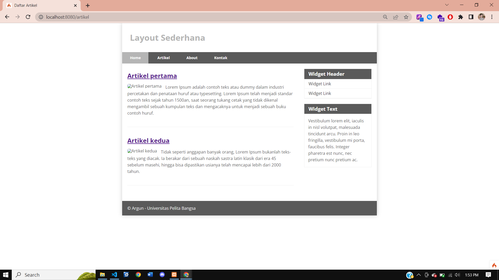

# Lab7_php_ci

framework CRUD PHP code igniter

###### Nama : Muhammad Arya Dipanegara Gunawan

###### NIM : 312110396

###### Kelas : TI.21.A3

Instruksi Praktikum

1. Persiapkan text editor misalnya VSCode.

2. Buka kembali folder dengan nama lab11_php_ci pada docroot webserver (htdocs)

3. Ikuti langkah-langkah praktikum yang akan dijelaskan berikutnya.

Langkah-langkah Praktikum

Persiapan.

Untuk memulai membuat aplikasi CRUD sederhana, yang perlu disiapkan adalah
database server menggunakan MySQL. Pastikan MySQL Server sudah dapat dijalankan
melalui XAMPP.

#### Membuat Database & Tabel

#### Konfigurasi koneksi database

Selanjutnya membuat konfigurasi untuk menghubungkan dengan database server.
Konfigurasi dapat dilakukan dengan du acara, yaitu pada file app/config/database.php
atau menggunakan file .env. Pada praktikum ini kita gunakan konfigurasi pada file .env.

#### Membuat Model

Selanjutnya adalah membuat Model untuk memproses data Artikel. Buat file baru pada
direktori app/Models dengan nama ArtikelModel.php

#### Membuat Controller

Buat Controller baru dengan nama Artikel.php pada direktori app/Controllers.

#### Membuat View

Buat direktori baru dengan nama artikel pada direktori app/views, kemudian buat file
baru dengan nama index.php.

Selanjutnya buka browser kembali, dengan mengakses url http://localhost:8080/artikeL

Belum ada data yang diampilkan. Kemudian coba tambahkan beberapa data pada
database agar dapat ditampilkan datanya.

Refresh kembali browser, sehingga akan ditampilkan hasilnya.

#### Membuat Tampilan Detail Artikel

Tampilan pada saat judul berita di klik maka akan diarahkan ke halaman yang berbeda.
Tambahkan fungsi baru pada Controller Artikel dengan nama view().

#### Membuat View Detail

Buat view baru untuk halaman detail dengan nama app/views/artikel/detail.php

#### Membuat Routing untuk artikel detail

Buka Kembali file app/config/Routes.php, kemudian tambahkan routing untuk artikel
detail.

#### Membuat Menu Admin

Menu admin adalah untuk proses CRUD data artikel. Buat method baru pada
Controller Artikel dengan nama admin_index().

Selanjutnya buat view untuk tampilan admin dengan nama admin_index.php

Tambahkan routing untuk menu admin seperti berikut:

Akses menu admin dengan url http://localhost:8080/admin/artikel

#### Menambah Data Artikel

Tambahkan fungsi/method baru pada Controller Artikel dengan nama add()

Kemudian buat view untuk form tambah dengan nama form_add.php

hasil

#### Mengubah Data

Tambahkan fungsi/method baru pada Controller Artikel dengan nama edit().

Kemudian buat view untuk form tambah dengan nama form_edit.php

hasil :

#### Menghapus Data

Tambahkan fungsi/method baru pada Controller Artikel dengan nama delete().

Hasil :

## Pertanyaan dan Tugas

Selesaikan programnya sesuai Langkah-langkah yang ada. Anda boleh melakukan
improvisasi.

#### Laporan Praktikum

1. Melanjutkan praktikum sebelumnya pada repository dengan nama lab7web.
2. Kerjakan semua latihan yang diberikan sesuai urutannya.
3. Screenshot setiap perubahannya.
4. Update file README.md dan tuliskan penjelasan dari setiap langkah praktikum
   beserta screenshotnya.
5. Commit hasilnya pada repository masing-masing.
6. Kirim URL repository pada e-learning ecampus
